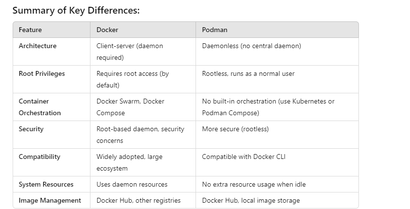

# Container

Container is used to run application. it also can host OS. but it doesnt make sense to use the containter in that way.

Containers are package of the application and their related dependencies along with the required OS modules. (not all OS but required OS modules)

Containers work on a native linux features namely - control groups (C groups) and namespaces 

Control groups as the name suggest this is for the control or limit the resources
name spaces isolating the resources from other.

Docker is a container runtime.

Docker or any container runtime has some important components:

Client

daemon

container D : containerd is an open-source container runtime used to manage the lifecycle of containers. It’s a core component that handles the low-level details of running containers on a system, making it easier to work with containerized applications. Think of it as the engine that runs containers, while Docker and other container management tools sit on top to provide a user-friendly interface.

Docker is a high level runtime means it uses containerD as a base and provides a easy user experience on working with containers. 

 sudo yum-config-manager --add-repo https://download.docker.com/linux/rhel/docker-ce.repo - this is used to add a repo to the system.

Concept of container:

1.) container is not like OS. where we can start or stop a container or SSH into it. there is no concept of SSH into the container. 
2.) container will run a single process.
3.) so as mentioned we cannot start or stop a container. 
4.) so whenever we run a container a brand new container will run and after completing the task the container will die.
5.) to differentiate a container with other container we use container ID.
6.) Images are used to create container. (images = AMI and containers = Ec2 instances)
7.) we can create containers as per our requirement.

how to get the image:

docker pull <image-name>
docker images - shows all the images present in the system.

Docker images command output: this shows the version of the image and from where it downloaded and how old the version that we are using is.

REPOSITORY               TAG         IMAGE ID      CREATED      SIZE
docker.io/library/nginx  latest      7f553e8bbc89  11 days ago  196 MB

you can remove a image when there are containers running using that image. so first end the containers and then remove the image, 

docker run -d <image-name> this will run the container in dettached mode. means the container will be running in the background.

Conternization: 

